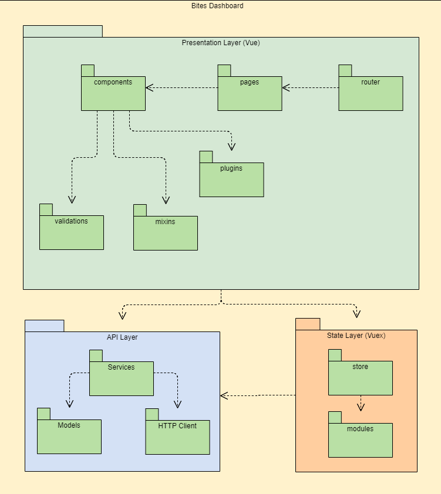

# Architecture

- [Architecture](#architecture)
  - [Presentation Layer (Vue)](#presentation-layer-vue)
  - [Plugins](#plugins)
  - [Vuetify Dialog](#vuetify-dialog)
  - [Data List Component](#data-list-component)
    - [Data List Slots](#data-list-slots)
      - [Data List Default Slot Props:-](#data-list-default-slot-props-)
    - [Data List Dynamic Slots](#data-list-dynamic-slots)
    - [Data List Events](#data-list-events)
  - [Data Model Component](#data-model-component)
    - [Data Model Slots](#data-model-slots)
      - [Data Model Default Slot Props:-](#data-model-default-slot-props-)
    - [Data Model Events](#data-model-events)
  - [Crud Generator](#crud-generator)
  - [State Layer (Vuex)](#state-layer-vuex)
  - [State Module Generator](#state-module-generator)
  - [API Layers](#api-layers)
  - [Models](#models)
  - [API Model Generator](#api-model-generator)
  - [Services](#services)
  - [API Service Generator](#api-service-generator)
  - [HTTP Client](#http-client)
  - [HTTP Interceptors](#http-interceptors)



## Presentation Layer (Vue)

- [Presentation Layer (Vue)](<#presentation-layer-(Vue)>)
  - [Plugins](#plugins)
  - [Data List Component](#data-list-component)
  - [Data Model Component](#data-model-component)
  - [Crud Generator](#crud-generator)

## Plugins

- [Plugins](#plugins)

  - [vuetify-dialog](#vuetify-dialog) - [Github Repo](https://github.com/yariksav/vuetify-dialog)
  - [vuetify]((<https://github.com/AbdelrhmanAbdelhamed/vuetify-dashboard-boilerplate/blob/master/src/plugins/vuetify/index.js>) - [Github Repo](https://github.com/vuetifyjs/vuetify)
  - [vue-i18n]((<https://github.com/AbdelrhmanAbdelhamed/vuetify-dashboard-boilerplate/blob/master/src/plugins/i18n/index.js>) - [Github Repo](https://github.com/kazupon/vue-i18n)
  - [casl]((<https://github.com/AbdelrhmanAbdelhamed/vuetify-dashboard-boilerplate/blob/master/src/plugins/casl/index.js>) - [Github Repo](https://github.com/stalniy/casl)
  - [vue-loading-overlay]((<https://github.com/AbdelrhmanAbdelhamed/vuetify-dashboard-boilerplate/blob/master/src/plugins/loadingOverlay/index.js>) - [Github Repo](https://github.com/ankurk91/vue-loading-overlay)
  - [vue-ctk-date-time-picker]((<https://github.com/AbdelrhmanAbdelhamed/vuetify-dashboard-boilerplate/blob/master/src/plugins/vueCtkDateTimePicker/index.js>) - [Github Repo](https://github.com/chronotruck/vue-ctk-date-time-picker)
  - [vue-clipboard2]((<https://github.com/AbdelrhmanAbdelhamed/vuetify-dashboard-boilerplate/blob/master/src/plugins/vueClipboard/index.js>) - [Github Repo](https://github.com/Inndy/vue-clipboard2)
  - [vue-input-facade]((<https://github.com/AbdelrhmanAbdelhamed/vuetify-dashboard-boilerplate/blob/master/src/plugins/vueInputFacade/index.js>) - [Github Repo](https://github.com/RonaldJerez/vue-input-facade)
  - [vue-upload-component]((<https://github.com/AbdelrhmanAbdelhamed/vuetify-dashboard-boilerplate/blob/master/src/components/Common/FileUpload/FileUpload.vue>) - [Github Repo](https://github.com/lian-yue/vue-upload-component)

To add a plugin just create a folder with its name inside `src/plugins` and inside that folder create an `index.js` file that contains the initiation of the plugin with `vue` along with any options to customize the plugin.

Here's an example of how to add vue-ctk-date-time-picker plugin:-

```js
// @file src/plugins/vueCtkDateTimePicker/index.js

import Vue from 'vue'

import VueCtkDateTimePicker from 'vue-ctk-date-time-picker'
import 'vue-ctk-date-time-picker/dist/vue-ctk-date-time-picker.css'

Vue.component('VueCtkDateTimePicker', VueCtkDateTimePicker)
```

Then expose the file which will automatically be used in `src/main.js`

```js
// @file src/plugins/index.js

import './vueCtkDateTimePicker'
```

In case your plugin need to be initialized after `vue`, `vuex` init then use `initPlugins` function instead.

For example:-

```js
// @file src/plugins/index.js

export function initPlugins({ store }) {
  if (!Vue.prototype.$ability) {
    Vue.use(abilitiesPlugin, store.state.abilities.currentAbility)
  }
  if (!Vue.prototype.$dialog) {
    initVuetifyDialog({ Vue, store, i18n, vuetify })
  }
}
```

One more thing about plugins, there's a helper function called `getPlugin(pluginName, Vue = _Vue)` that gets a plugin from `Vue.prototype` by default to be used outside vue context which can be useful in many ways.

For example:-

```js
// @file src/api/clients/http/index.js
...
const http = new Http({
  onSuccess: (response, successMessage) => {
    const vuetifyDialog = getPlugin('$dialog')

    const message =
      invokeOrReturn(successMessage, response) || response.message || i18n.t('default_success_message')

    vuetifyDialog.notify.success(message)
  },
})
...
```

## Vuetify Dialog

This module will help you work with vuetify dialogs without annoyed templates

There's a [`DynmaicDialog`]((<https://github.com/AbdelrhmanAbdelhamed/vuetify-dashboard-boilerplate/blob/master/src/router/layouts/DynamicDialog/DynamicDialog.vue>) layout ready to be used by the dialog/modal components

Here's how to use it:-

```js
// @file src/components/marketing/promotions/PromotionInputForm PromotionInputForm.vue

export default {
  // Here you specified the layout inside the component itself
  // So no need to specify it when showing the dialog.
  layout: 'dynamic-dialog',
  props: {},
  computed: {},
  methods: {
    async handleSave() {
      ...
      const promotion = await this.createOrUpdateAction(this.promotionFormData)
      if (promotion) {
        return this.saveAndClose(promotion)
      }
    },
  }
```

```js
// @file src/components/marketing/promotions/PromotionList/PromotionList.vue

import PromotionInputForm from '../PromotionInputForm/PromotionInputForm.vue'

const promotion = await this.$dialog.showAndWait(
  PromotionInputForm,
  // Or { ...PromotionInputForm, layout: 'dynamic-dialog' },
  // If you didn't already specified the layout inside the component itself.
  {
    // Those are the layout props itself. AKA (v-dialog)
    title: 'Add New Promotion',
    width: '800px',
    persistent: true,
    // Those are the layout props itself. AKA (v-dialog)

    // props are the props that the PromotionInputForm component expects.
    props: {
      item: new PromotionModel(),
      createOrUpdateAction: createItem,
      fetchList,
      goToPage,
    },
  }
)
```

For more info please refer to:-

1. [`src/plugins/vuetifyDialog/index.js`]((<https://github.com/AbdelrhmanAbdelhamed/vuetify-dashboard-boilerplate/blob/master/src/plugins/vuetifyDialog/index.js>) (Here we keep tracking of the dialogs so that we can clear them all using custom `clearDialogs` method. We also register a custom dynamic dialog layout)
2. [vuetify-dialog docs](https://github.com/yariksav/vuetify-dialog)

## Data List Component

[`src/components/Common/DataList/DataList.vue`]((<https://github.com/AbdelrhmanAbdelhamed/vuetify-dashboard-boilerplate/blob/master/src/components/Common/DataList/DataList.vue>)

It's a renderless component that encapsulate and abstract the fetching/manipulating logic of a list of data from the view then provide it using its default slot.

_That way we can have many views as we want like the `DataListCardView` if we want a list to be rendered in cards not just restricted a table view. however the [`DataListTableView`]((<https://github.com/AbdelrhmanAbdelhamed/vuetify-dashboard-boilerplate/blob/master/src/components/Common/DataListTableView/DataListTableView.vue>) is the default one._

- DataListTableView works as a transparent wrapper component of vuetify `v-data-table` component which means all `props`, `events` and `slots` are working just the same.

There are two required props:-

- module `string` (The vuex module that the component will use to fetch and manipulate the data through its vuex actions i.e `promotions`)
- model `string` (model name i.e `Promotion`)

Please refer to [src/mixins/crudable/crudable.js]((<https://github.com/AbdelrhmanAbdelhamed/vuetify-dashboard-boilerplate/blob/master/src/mixins/crudable/crudable.js>) to see how action names is being formed.

_And there's one optional prop called `filters`: `object` which is used to query/filter the data and it will be send as a query params._

by defaults is has the following values:-

```js
{
  page: 1,
  itemsPerPage: 10,
  sortBy: ['createdAt'],
  sortDesc: [true],
  groupBy: [],
  groupDesc: [],
  multiSort: false,
  mustSort: false,
}
```

_and it will be mapped by the api layer into:_

```js
{
  page: 0,
  limit: 10,
  sort: '-created_at',
}
// then it will be send as a query params with request
```

If you want to use the default [`DataListTableView`]((<https://github.com/AbdelrhmanAbdelhamed/vuetify-dashboard-boilerplate/blob/master/src/components/Common/DataListTableView/DataListTableView.vue>) then you need to provide another prop called `headers` which is the headers of the table (Works the same as v-data-table headers plus extra `actions` header).

- There's default actions `create/update/delete` but you can define extra actions using `actions: any[]` prop as the following example:

```js
const actions = [
  {
    name: 'history',
    label: this.$t('item_history', { item: this.$tc('user', 1) }),
    iconName: 'mdi-clipboard-text',
    btnAttrs: {
      color: 'amber',
    },
  },
]
```

Here's how to define a PromotionList:-

```js
inheritAttrs: false,
data() {
  return {
    headers: [...],
    actions: [...]
  }
},
computed: {
  attrs() {
    return {
      module: 'promotions',
      model: 'Promotion',
      ...this.$attrs,
    }
  },
},
```

```html
<data-list :headers="headers" :actions="actions" v-bind="attrs"> </data-list>
```

For full PromotionList file please refer to [`src/components/marketing/promotions/PromotionList/PromotionList.vue`]((<https://github.com/AbdelrhmanAbdelhamed/vuetify-dashboard-boilerplate/blob/master/src/components/marketing/promotions/PromotionList/PromotionList.vue>)

You can also hide any of the default actions or customize them using the props available in [`src/mixins/listable/listable.js`]((<https://github.com/AbdelrhmanAbdelhamed/vuetify-dashboard-boilerplate/blob/master/src/mixins/listable/listable.js>)

### Data List Slots

#### Data List Default Slot Props:-

```yaml
module: string
model: string
fetchList: (config: object) => Promise<any[]>
createItem: (item: object, config: object) => Promise<any>
goToPage: (page: number) => void
items: any[]
pages: number
total: number
loading: boolean
headers: any[]
```

### Data List Dynamic Slots

Dynamic slots are being placed in many areas, the names of these slots are not fixed as they are being determined based on dynamic values

| Slot | Description | Props |
| --- | --- | --- |
| `action.<name>` | You can replace any action in the table using the `name` attribute of the action | item: `object` represents the whole record. |

### Data List Events

| Event | Description | Payload |
| --- | --- | --- |
| create | Fires on Create Button Click | { createItem, fetchList, goToPage } |
| update | Fires on Update/Edit Button/Icon Click | { item, updateItem, fetchList, goToPage } |
| delete | Fires on Delete Button/Icon Click | { item, deleteItem, fetchList, goToPage } |
| actionName | Fires on `actionName` Button/Icon Click | { item, fetchList, goToPage, updateItem, deleteItem, createItem } |

## Data Model Component

It's a renderless component that encapsulate and abstract the fetching/manipulating logic of a single item from the view then provide it using its default slot.

_NOTE: It's being used In Conjunction With [`DataListTableView`]((<https://github.com/AbdelrhmanAbdelhamed/vuetify-dashboard-boilerplate/blob/master/src/components/Common/DataListTableView/DataListTableView.vue>). But it can also be used along with any presentation/view component._

There are three required props:-

- module `string` (The vuex module that the component will use to fetch and manipulate the data through its vuex actions i.e `promotions`)
- model `string` (model name i.e `Promotion`)
- id `string` (The id of the item to be fetched)

You can also pass `item` prop directly and in that case the component will use this `item` and will not fetch the item using the provided id (however prop `id` must be passed)

Here's an example:-

```js
data() {
  return {
    module: 'promotions',
    model: 'Promotion',
    item: {...},
  }
}
```

```html
<data-model
  :id="item.id"
  :item="item"
  :module="module"
  :model="model"
  @updated="updatedListener"
  @deleted="deletedListener"
>
</data-model>
```

### Data Model Slots

#### Data Model Default Slot Props:-

```yaml
id: string
fetchItem: ({ config: object }) => Promise<any>
updateItem: ({ item: object, extraPayload: object, resourcesHierarchy: object, config: object }) => Promise<any>
deleteItem: ({ extraPayload: object, resourcesHierarchy: object, config: object }) => void
item: object
module: string
model: string
```

### Data Model Events

| Event   | Description                             | Payload |
| ------- | --------------------------------------- | ------- |
| updated | Fires after item `updated` successfully | void    |
| deleted | Fires after item `deleted` successfully | void    |

To see how it all fits togehter please refer to:-

1.  [`src/components/Common/DataListTableView/DataListTableView.vue`]((<https://github.com/AbdelrhmanAbdelhamed/vuetify-dashboard-boilerplate/blob/master/src/components/Common/DataListTableView/DataListTableView.vue#L127>)
2.  [`src/components/Common/DataModel/DataModel.vue`]((<https://github.com/AbdelrhmanAbdelhamed/vuetify-dashboard-boilerplate/blob/master/src/components/Common/DataModel/DataModel.vue>)
3.  [`src/components/Common/DataList/DataList.vue`]((<https://github.com/AbdelrhmanAbdelhamed/vuetify-dashboard-boilerplate/blob/master/src/components/Common/DataList/DataList.vue>)

## Crud Generator

```ps
 npm run new crud
```

_In addition to generating `<Resource>List` Component, It will also generate a `<Resource>InputForm` component that will be used for basic `create`/`update` operations._

- It will also generate a basic view router component. _(For now you should register the route to the vue-router yourself here ([`src/router/routes.js`](<(https://github.com/AbdelrhmanAbdelhamed/vuetify-dashboard-boilerplate/blob/master/src/router/routes.js)>) then add a Nav Bar route item to The Nav Bar Component here ([`src/components/Common/TheNavbar/TheNavbar.vue`](<(https://github.com/AbdelrhmanAbdelhamed/vuetify-dashboard-boilerplate/blob/master/src/components/Common/TheNavbar/TheNavbar.vue)>) )_

And it will ask for the resource name (`src/router/views/<Resources>`).

Example: `npm run new crud promotions`

`name` will always be normalized to its singular pascal-case form concatenated to `'List'` postfix for the list component and `'InputForm'` for the form component. So `'promotion'`, `'Promotion'` and `'promotions'` will all yields to `'PromotionList'` and `'PromotionInputForm'`.

Then it will ask if you want to include a base search along with the list.

It will also ask if you want a draggable list or not.

- If you want to generate the `list` only then type `npm run new crud:list`
- If you want to generate the `form` only then type `npm run new crud:form`
- If you want to generate the `view` only then type `npm run new crud:view`

## State Layer (Vuex)

- [State Layer (Vuex)](<#state-layer-(Vuex)>)

  - [State Module Generator](#state-module-generator)

- We are following the convention of having [mutation-types.js]((<https://github.com/AbdelrhmanAbdelhamed/vuetify-dashboard-boilerplate/blob/master/src/state/mutation-types.js>) only

```js
...
// ===
// promotions
// ===
export const SET_PROMOTIONS = 'SET_PROMOTIONS'
export const ADD_PROMOTION = 'ADD_PROMOTION'
export const UPDATE_PROMOTION = 'UPDATE_PROMOTION'
export const REMOVE_PROMOTION = 'REMOVE_PROMOTION'
...
```

Action names should match this pattern exactly:-

| resourceService method | getById | getAll | create | update | delete |
| --- | --- | --- | --- | --- | --- |
| prefix | fetch | fetch | create | update | delete |
| postfix | Resource (pascal-case) | Resource (pascal-case) (plural) | Resource (pascal-case) | Resource (pascal-case) | Resource (pascal-case) |
| example action name | `fetchPromotion` | `fetchPromotions` | `createPromotion` | `updatePromotion` | `deletePromotion` |

Here's a full [promotions]((<https://github.com/AbdelrhmanAbdelhamed/vuetify-dashboard-boilerplate/blob/master/src/state/modules/promotions/promotions.js#L50>) actions example

```js
// @file src/state/modules/promotions/promotions.js

...

export const actions = {
  // This is automatically run in `src/state/store.js` when the app
  // starts, along with any other actions named `init` in other modules.
  init({ state, dispatch, rootState, rootGetters }) {},

  async fetchPromotion({ commit, state, rootState }, { id, config }) {
    // 1. Check if we've already fetched and cache the promotion.
    const matchedPromotion = state.promotions.find((promotion) => promotion.id === id)
    if (matchedPromotion) {
      return Promise.resolve(matchedPromotion)
    }

    // 2. Fetch the promotion from the API and cache it in case
    //    we need it again in the future.
    const response = await promotionsService.getById({id, config})
    if (response) {
      commit(ADD_PROMOTION, response)
      return response
    }
  },
  async fetchPromotions({ commit, state }, { config = {} } = {}) {
    const response = await promotionsService.getAll({ config })
    if (response?.promotions) {
      commit(SET_PROMOTIONS, {
        response,
        filters: cloneDeep(config.filters),
      })
      return response
    }
  },
  async createPromotion({ commit }, { item, config }) {
    const response = await promotionsService.getAll({ item, config })
    if (response) {
      commit(ADD_PROMOTION, response)
      return response
    }
  },
  async updatePromotion({ commit }, { item, config }) {
    const response = await promotionsService.update({ item, config })
    if (response) {
      commit(UPDATE_PROMOTION, response)
      return response
    }
  },
  async deletePromotion({ commit }, { id, config }) {
    await promotionsService.delete({ id, config })
    commit(REMOVE_PROMOTION, id)
  },
}

...

```

## State Module Generator

```ps
 npm run new module
```

And it will ask for the module name.

and it will prompt you for two additional options

1. include Reorder Action? _(To be used in conjunction with a draggable list)_
2. include Reset List State Action? _(To be able to reset the list & pagination data inside the module)_

Example: `npm run new module promotions`

`name` will always be normalized to its plural camel-case form so `promotion`, `Promotion` and `promotions` will all yield to `promotions`.

## API Layers

- [API Layers](#api-layers)
  - [Models](#models)
    - [API Model Generator](#api-model-generator)
  - [Services](#services)
    - [API Service Generator](#api-service-generator)
  - [HTTP Client](#http-client)
    - [HTTP Interceptors](#http-interceptors)

## Models

- [Models](#models)
  - [API Model Generator](#api-model-generator)

An Interface for all available resources which gave us control on the fields name and the fields value of each instance and provides insights on how each instance should look like.

So it works as a mapper from `raw/api` data to `app` data and vice versa.

- We are using it to overcome any inconsistency/drawback of the back-end `api` such as:

  - Converting each and every non-camelCase field to a camelCase one, to maintain our naming convention inside the entire app.
  - Deals with different `Date`/`Time` formats.
  - Turning pagination `page` response field into 1-based index instead of being 0-based index.

- We are using it to simplify and unify the back-end `api` data such as:
  - Combining `firstName` and `lastName` fields into `fullName` field.
  - Converting `[lng, lat]` array to `{lat, lng}` object back and forth.
  - Converting `translation` array to `translation` object map with `_lang` as the key and vice versa.

Each Model converts the `raw/api` data to the `model` data using `modelFieldsMap` as a parameter to the `fromRawData` method. and convert its `model` data back to the `raw/api` data using `rawFieldsMap` as a parameter to the `toRawData` method.

Also there's a `rawParamsMap` which responsible to map the query params from the `model` form/shape to the `raw/api` form/shape.

Here's The baseModel:-

```js
// @file src/api/models/BaseModel/BaseModel.js

...

/* eslint-disable camelcase */
export default class BaseModel {
  constructor(
    fields = {},
    { translationFields = BaseModel.translationFields, Model = BaseModel } = {}
  ) {
    const { id, createdAt, updatedAt, translation } = fields

    this.id = id
    this.createdAt = createdAt
    this.updatedAt = updatedAt

    if (translation) {
      this.translation = BaseModel.setDefaultTranslationLanguageValues({
        translation,
        translationFields: { ...translationFields, ...Model.translationFields },
        item: fields,
      })
    }
  }

  static modelFieldsMap = {
    _id: { name: 'id' },
    created_at: { name: 'createdAt' },
    updated_at: { name: 'updatedAt' },
    translation: {
      value: (translation) =>
        this.fromRawTranslation({
          translation,
        }),
    },
  }

  static rawFieldsMap = {
    id: { name: '_id' },
    createdAt: { name: 'created_at' },
    updatedAt: { name: 'updated_at' },
    translation: {
      value: (translation) => ObjectToValues(translation),
    },
  }

  static rawParamsMap = {
    page: {
      value(page) {
        return page - 1
      },
    },
    sortBy: {
      name: 'sort',
    },
    itemsPerPage: {
      name: 'limit',
      value(itemsPerPage) {
        return itemsPerPage < 0 ? 0 : itemsPerPage
      },
    },
    query: {
      name: 'q',
      value: (query) => query?.trim(),
    },
  }

  static translationFields = ['name', 'description', 'title', 'currency']

  static paramsToOmit = ['sortDesc']

  static getRawFieldName(field) {
    ...
    return rawFieldsMap[field]?.name || rawFieldsMap[field] || field
  }

  static getRawParamsName(field) {
    ...
    return rawParamsMap[field]?.name || rawParamsMap[field] || field
  }

  static toRawParams(fields) {
    ...
    return transformObject(this.toRawData(fields), rawParamsMap, {
      joinArrays: true,
    })
  }

  static fromRawTranslation({
    translation,
    langKey = '_lang',
    { translationFields = [ ...BaseModel.translationFields, ...this.translationFields ] } = {}
    item,
  } = {}) {
    const modelTranslation = Array.isArray(translation)
      ? valuesToObject({ values: translation, key: langKey })
      : translation

    return this.setDefaultTranslationLanguageValues({
      translation: modelTranslation,
      translationFields,
      item,
    })
  }

  static toRawData(fields, { returnProxy = false, translationOverrides = {} } = {}) {
    if (!fields) return fields

    const fieldsClone = BaseModel.cloneFields(fields)

    const rawDataProxyOrFields =
      fieldsClone instanceof FormData ? createFormDataProxy(fieldsClone) : fieldsClone

    ...

    return returnProxy ? { fields: fieldsClone, proxy: rawDataProxyOrFields } : fieldsClone
  }

  static cloneFields(fields) {
    return fields instanceof FormData ? fields : cloneDeep(fields)
  }

  static fromRawPhoneNumber(mobileNumber, countryCode = '+2') {
    ...
  }

  static toRawPhoneNumber(mobileNumber, countryCode = '+2') {
    ...
  }

  static fromRawTranslation({
    translation,
    langKey = '_lang',
    translationFields = [ ...BaseModel.translationFields, ...this.translationFields ],
    item,
  } = {}) {
    ...
  }

  static toRawTranslation({ translation }) {
    ...
  }

  static setDefaultTranslationLanguageValues({
    item,
    translationFields = [ ...BaseModel.translationFields, ...this.translationFields ],
    translation = {},
    defaultTranslationCode = store.state.core.defaultLanguageCode,
  }) {
    ...
  }

  static setFieldsFromDefaultTranslationInPlace({
    item,
    overrides = {},
    defaultTranslationCode = store.state.core.defaultLanguageCode,
  } = {}) {
    ...
  }
}
```

Here's how a Promotion Model which extends the BaseModel looks like

```js
// @file src/api/models/PromotionModel/PromotionModel.js

...

import { secondsToHours, formattedTimeToSeconds, formatDate } from '@utils/dateTimeUtils'

import BaseModel from '../BaseModel/BaseModel'
import RestaurantModel from '../RestaurantModel/RestaurantModel'

/* eslint-disable camelcase */
export default class PromotionModel extends BaseModel {
  static get modelName() {
    return 'Promotion'
  }

  constructor(fields = { translation: {} }) {
    const {
      order = {
        min: 1,
        max: 1,
      },
      codeCount = 1,
      codeCountPerUser = 1,
      codeUsage = 0,
      activeHours,
      startTime = '00:00',
      endTime = '00:00',
      isOffer = false,
      isActive = false,
      name = '',
      description = '',
      country,
      image = '',
      code = '',
      discount = {
        type: 'fixed', // Value from PROMOTION_DISCOUNT_TYPES_ENUM
        amount: 1,
        upperBound: Number.MAX_SAFE_INTEGER,
        appliedOn: '', // Value from PROMOTION_DISCOUNT_ON_ENUM
      },
      restaurants = [],
      startDate = '', // DATE
      endDate = '', // DATE
      user = null,
    } = fields

    super(fields)

    this.order = order
    this.codeCount = codeCount
    this.codeCountPerUser = codeCountPerUser
    this.codeUsage = codeUsage
    this.activeHours = activeHours
    this.startTime = startTime
    this.endTime = endTime
    this.isOffer = isOffer
    this.isActive = isActive
    this.name = name
    this.description = description
    this.country = country
    this.image = image
    this.code = code
    this.discount = discount
    this.restaurants = restaurants
    this.startDate = startDate
    this.endDate = endDate
    this.user = user
  }

  static modelFieldsMap = {
    code_count: { name: 'codeCount' },
    code_count_per_user: { name: 'codeCountPerUser' },
    code_usage: { name: 'codeUsage' },
    active_hours: { name: 'activeHours' },
    start_time: {
      name: 'startTime',
      // In seconds 0 - 86400 {Hours (24 format) X 3600}
      value: (start_time) => secondsToHours(start_time),
    },
    end_time: {
      name: 'endTime',
      // In seconds 0 - 86400 {Hours (24 format) X 3600}
      value: (end_time) => secondsToHours(end_time),
    },
    is_offer: { name: 'isOffer' },
    is_active: { name: 'isActive' },
    discount: {
      value: (discount) => ({
        type: discount?.type, // Value from PROMOTION_DISCOUNT_TYPES_ENUM
        amount: discount?.amount,
        upperBound: discount?.upper_bound,
        appliedOn: discount?.applied_on, // Value from PROMOTION_DISCOUNT_ON_ENUM
      }),
    },
    restaurants: {
      value: (restaurants) =>
        restaurants
          ? restaurants.map((restaurant) => RestaurantModel.fromRawData(restaurant))
          : restaurants,
    },
    start_date: {
      name: 'startDate',
      value: (start_date) => formatDate(start_date),
    },
    end_date: {
      name: 'endDate',
      value: (end_date) => formatDate(end_date),
    },
    user: null,
  }

  static rawFieldsMap = {
    codeCount: { name: 'code_count' },
    codeCountPerUser: { name: 'code_count_per_user' },
    codeUsage: { name: 'code_usage' },
    activeHours: { name: 'active_hours' },
    startTime: {
      name: 'start_time',
      value: (startTime) => formattedTimeToSeconds(startTime),
    },
    endTime: {
      name: 'end_time',
      value: (endTime) => formattedTimeToSeconds(endTime),
    },
    isOffer: { name: 'is_offer' },
    isActive: { name: 'is_active' },
    discount: {
      value: (discount) => {
        return {
          type: discount.type,
          amount: discount.amount,
          upper_bound: discount.upperBound ? discount.upperBound : Number.MAX_SAFE_INTEGER,
          applied_on: discount.appliedOn,
        }
      },
    },
    restaurants: {
      value: (restaurants) =>
        restaurants.map((restaurant) => RestaurantModel.toRawData(restaurant)),
    },
    startDate: {
      name: 'start_date',
      // Here we only care about the date not the time
      // But the api requires a timestamp like format
      value: (startDate) => startDate + 'T00:00:00.000Z',
    },
    endDate: {
      name: 'end_date',
      // Here we only care about the date not the time
      // But the api requires a timestamp like format
      value: (endDate) => endDate + 'T00:00:00.000Z',
    },
  }
}
```

then you need to register it with the models:-

```js
// @file src/api/models/index.js

...
import PromotionModel from './PromotionModel/PromotionModel'
...

export {
  ...
  PromotionModel,
  ...
}

```

## API Model Generator

```ps
 npm run new model
```

And it will ask for the model name if not provided

- It will also ask whether the Model to be generate has translation fields or not.

Example: `npm run new model promotions`

`name` will always be normalized to its singular pascal-case form concatenated to `'Model'` postfix. So `'promotion'`, `'Promotion'` and `'promotions'` will all yields to `'PromotionModel'`.

## Services

- [Services](#services)
  - [API Service Generator](#api-service-generator)

Responsible for handling api http(s) calls for each corresponding resource.

- Every `Service` expect a `client` injected through its constructor _that makes it easy to be mocked._.
  - _It's the `axios` wrapper class `httpClient` by default._

```js
// @file src/api/services/BaseService/BaseService.js

...

export default class BaseService {
 get endPointSearchPostfix() {
    return ''
  }

  get resourcesHierarchy() {
    return { [this.resource]: '' }
  }

  get resource() {
    throw new Error('"resource" getter is not defined, please make sure to override it')
  }

  get resourcesEndPointMap() {
    return {}
  }

  get Model() {
    throw new Error('"Model" getter is not defined, please make sure to override it')
  }

  constructor(client) {
    this.client = client || httpClient
  }

  create({
    item,
    resourcesHierarchy = this.resourcesHierarchy,
    config,
    resource = this.resource,
    Model = this.Model,
  } = {}) {
    ...
    return this.client.post(endPoint, itemRawData, normalizedConfig)
  }

  getAll({
    resourcesHierarchy = this.resourcesHierarchy,
    config,
    resource = this.resource,
    Model = this.Model,
  } = {}) {
    ...
    return this.client.get(endPoint, normalizedConfig)
  }

  getList({
    resourcesHierarchy = this.resourcesHierarchy,
    config,
    resource = this.resource,
    Model = this.Model,
  } = {}) {
    ...
    const endPoint = normalizedConfig.endPoint ?? `${this.endPoint || this.generateEndPoint(resourcesHierarchy)}/list`

    return this.client.get(endPoint, normalizedConfig)
  }

  getById({
    id,
    resourcesHierarchy = this.resourcesHierarchy,
    config,
    resource = this.resource,
    Model = this.Model,
  } = {}) {
    ...
    return this.client.get(endPoint, normalizedConfig)
  }

  update({
    item,
    resourcesHierarchy = this.resourcesHierarchy,
    config,
    resource = this.resource,
    Model = this.Model,
  } = {}) {
    ...
    return this.client.put(endPoint, itemRawData, normalizedConfig)
  }

  delete({
    id,
    resourcesHierarchy = this.resourcesHierarchy,
    config,
    resource = this.resource,
  } = {}) {
    ...
    return this.client.delete(endPoint, normalizedConfig)
  }
}

```

Here's how to create Promotion resource Service

- Just extend BaseService and define two required getters:-

  - resource `string` (serve as default endPoint)
  - Model `Object` (Model interface that will wrap the response)

```js
// @file src/api/services/PromotionService/PromotionService.js

import BaseService from '../BaseService/BaseService'
import Promotion from '../../models/PromotionModel/PromotionModel'

export default class PromotionsService extends BaseService {
  get resource() {
    return 'promotions'
  }

  get Model() {
    return Promotion
  }
}
```

then you need to register it with the services:-

```js
// @file src/api/services/index.js

...
import PromotionsService from './PromotionsService/PromotionsService'
...

...
export const promotionsService = new PromotionsService()
...
```

- You can define optional `endPointSearchPostfix` in case that `GET` with params/filters is implemented by adding extra route such as `restaurants/search`.

- You can also use `resourcesEndPointMap` to map resource name to the corresponding api route/endpoint name (If they're not the same) as following:-

```js
// @file src/api/services/NotificationsService/NotificationsService.js

import BaseService from '../BaseService/BaseService'

import Notification from '../../models/NotificationModel/NotificationModel'

export default class NotificationsService extends BaseService {
  get resource() {
    return 'notifications'
  }

  get resourcesEndPointMap() {
    return { [this.resource]: 'custom-notifications' }
  }

  get Model() {
    return Notification
  }
}
```

- You can use `resourcesHierarchy` to generate a sub/nested resources url. ( { `resource1`: `key1`, `resource2`: `''`, `resource3`: `key3` } ) yields to `resource1/key1/resource2/resource3/key3`

- You can provide a custom endPoint per individual request using `config` object and it will take precedence over `resource` and `resourcesHierarchy` getters.

  - In that case you need to define the full endPoint including any postfix like `id`, `refund` or `list`. _(You don't need to do that if you used `resourcesEndPointMap` to map resource name to the corresponding api route/endpoint name or used `resource` getter directly or even used the `resourcesHierarchy` to generate a sub/nested resources url)_

```js
// @file src/components/administration/orders/OrderRefund/OrderRefund.vue

...
await this.$store.dispatch('orders/updateOrder', {
  item: this.order,
  config: {
    endPoint: `/restaurants/${this.order.restaurantInfo.id}/orders/${this.order.id}/refund`,
    successMessage: 'Order Refunded Successfully',
  },
})
...
```

```js
// @file src/state/modules/orders/orders.js

  ...
  import { ordersService } from '@services'
  // Here we are using @services alias which is defined in
  // `/aliases.config`
  ...

  async updateOrder({ commit }, { item, config }) {
    const response = await ordersService.update({ item, config })
    if (response) {
      commit(UPDATE_ORDER, response)
      return response
    }
  },
  ...
```

## API Service Generator

```ps
 npm run new service
```

And it will ask for the service name which will be used for `resource` getter.

It also will ask for the optional `endPoint` getter (you can leave it blank).

_It will use the service name to assign a proper Model getter by change the service name to a pascal case form._ (So make sure to generate a `model` with same name as the service - [API Model Generator](#api-model-generator))

Example: `npm run new service promotions`

`name` will always be normalized to its plural pascal-case form concatenated to `'Service'` postfix. So `'promotion'`, `'Promotion'` and `'promotions'` will all yields to `'PromotionsService'`.

## HTTP Client

- [HTTP Client](#http-client)
  - [HTTP Interceptors](#http-interceptors)

A wrapper class for axios client that extends it with a various hooks such as:

- `onStart()` _Called before start the request_
- `onSuccess(response, successMessage)` _Called if `no` error occured_
- `onError(error, errorMessage)` _Called if an error occured_
- `onFinish()` _Called after request finish (whether `success` or `error`)_

Every request expect a config `object` that match `axios` config plus extra fields like the above `hooks`, a `successMessage` and a `errorMessage` which has a certain default values that can be overriden as the following snippet:

```js
...
{
  onStart: () => {
    if (!overlayLoader) overlayLoader = loadingOverlay.show()
  },
  onSuccess: (response, successMessage) => {
    const vuetifyDialog = getPlugin('$dialog')

    const message =
      invokeOrReturn(successMessage, response) || response.message || i18n.t('default_success_message')

    vuetifyDialog.notify.success(message)
  },
  onError: (error, errorMessage, status) => {
    const vuetifyDialog = getPlugin('$dialog')

    const message =
      invokeOrReturn(errorMessage, error) || error.message || i18n.t('default_error_message')

    vuetifyDialog.notify.error(message)
  },
  onFinish: () => {
    if (overlayLoader) overlayLoader = overlayLoader.hide()
  },
...
}
```

_You can also disable any of the above hooks by setting its value to `false`_. This might come in handy if you want to disable the default error handler (the above default `onError` hook) and deal with error manually using `try/catch` or `.catch()` clause.

## HTTP Interceptors

- It also provides an interface for adding/removing interceptors:--

```js
  // @file src/api/clients/http/Axios.js#L123:L140

  addInterceptor(interceptor) {
    interceptor.id = this.interceptors[interceptor.type].use(
      (configOrResponse) => {
        this.invokeHook(interceptor.onSuccess, configOrResponse)
        return configOrResponse
      },
      (error) => {
        const onErrorCalled = this.invokeHook(interceptor.onError, error)
        if (!onErrorCalled) return Promise.reject(error)
      }
    )
    return interceptor
  }

  removeInterceptor(interceptor) {
    if (!interceptor.id) return Promise.reject(new Error('Missing or invalid interceptor id'))
    return this.interceptors[interceptor.type].eject(interceptor.id)
  }
```

```js
// @file src/api/clients/http/Interceptor.js

import { ObjectToValues } from '@utils'

export const INTERCEPTOR_TYPES = {
  REQUEST: 'request',
  RESPONSE: 'response',
}

export default class Interceptor {
  constructor({ name, type, onSuccess, onError }) {
    if (!ObjectToValues(INTERCEPTOR_TYPES).includes(type)) {
      throw new Error(
        `Invalid Interceptor type for '${type}', it should be one of ${ObjectToValues(
          INTERCEPTOR_TYPES
        )}`
      )
    }

    this.id = ''
    this.name = name
    this.type = type
    this.onSuccess = onSuccess || ((configOrResponse) => configOrResponse)
    this.onError = onError || ((error) => Promise.reject(error))
  }
}
```

To add an interceptor just add it to the [`interceptorList`]((<https://github.com/AbdelrhmanAbdelhamed/vuetify-dashboard-boilerplate/blob/master/src/api/clients/http/interceptorList.js>) and it will be automatically registered [by this line here]((<https://github.com/AbdelrhmanAbdelhamed/vuetify-dashboard-boilerplate/blob/master/src/api/clients/http/index.js#L36>). (_The order and the type of the interceptor matters so make sure that you got it right_).

Here's a response interceptor that responsible for deauthorize the user:-

```js
// @file src/api/clients/http/InterceptorList.js

import router from '@router'

import Interceptor, { INTERCEPTOR_TYPES } from './Interceptor'

import { getPlugin } from '@plugins'

const UnauthorizedErrorStatus = 401
const UnauthenticatedErrorStatus = 403

const deauthorizeInterceptor = new Interceptor({
  name: 'deauthorizeInterceptor',
  type: INTERCEPTOR_TYPES.RESPONSE,
  onError: (error) => {
    const shouldDeauthorizeUser =
      error.response?.status === UnauthorizedErrorStatus ||
      (error.response?.status === UnauthenticatedErrorStatus &&
        router.currentRoute.name !== 'login')

    if (shouldDeauthorizeUser) {
      const vuetifyDialog = getPlugin('$dialog')
      vuetifyDialog.clearDialogs()
      router.replace({ name: 'logout' }).catch(() => {})
    } else {
      throw error
    }
  },
})

export default [deauthorizeInterceptor]
```

For more info please refer to:

- [`src/api/clients/http/Axios.js`]((<https://github.com/AbdelrhmanAbdelhamed/vuetify-dashboard-boilerplate/blob/master/src/api/clients/http/Axios.js>)

- [`src/api/clients/http/index.js`]((<https://github.com/AbdelrhmanAbdelhamed/vuetify-dashboard-boilerplate/blob/master/src/api/clients/http/index.js>)

- [Axios Official Github Repo](https://github.com/axios/axios)
